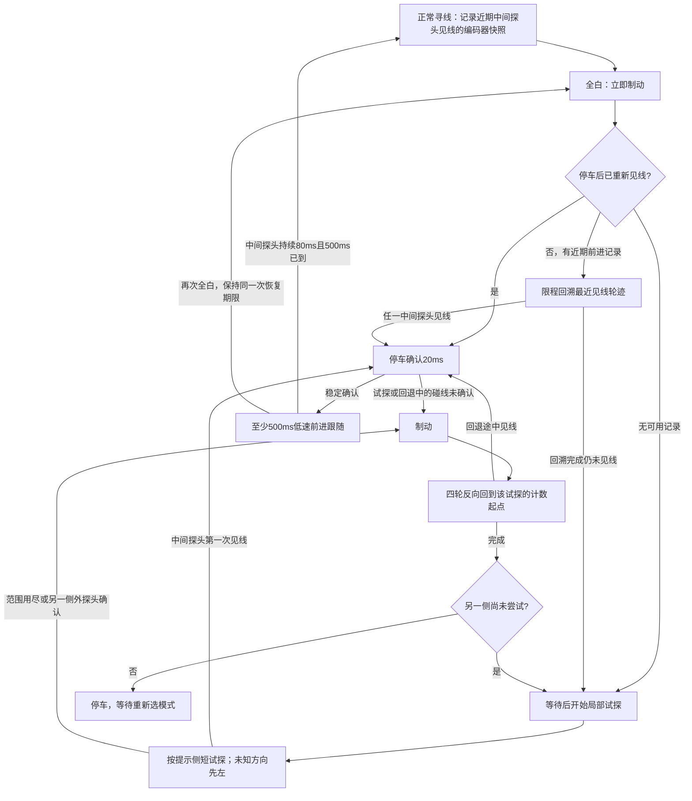

# 丢线后先回溯，再局部试探

用户最新反馈：右前轮能正常旋转，但丢线后原地搜索使车身向赛道外偏移，
角度扫够也已经远离黑线。左右两个方向都曾观察到偏向右前轮。
本次改变恢复策略，不继续修改单轮配速或声称计算出了真实旋转中心。

## 状态流程

整次恢复8秒超时或驱动故障，从任何恢复/低速确认阶段停车。图中的回溯完成、
回退完成是四轮编码器条件，不是真实车身位姿复原的证明。

## 具体规则

1. 正常寻线时每20ms保存一个中间探头见线的四轮快照，最多16个。
   两个外探头同时黑的宽交叉状态不作为可靠参考；普通转向中任何轮收到
   反向目标时清除这段前进历史，避免把原地打滑历史当成可逆的前进路线。
2. 丢线即使用已有主动制动，调用者在制动期间不能用普通滑行停车覆盖它。
   若刹停期间黑线已回来，先停车确认，不强行倒退。
3. 优先找距离当前至少80ms、最多600ms的最近见线快照；没有够老的点可用时
   使用更新的可用点。按各轮当前计数与快照之差，给出符号相反的限程目标。
   每轮目标最大为45mm轮缘行程；若差值更大，四轮同比缩放。最多进行两次
   这种回溯，不能无限向后走。无记录则跳过回溯，不任意倒车。
4. 试探沿用名义2493 CPS（90 deg/s对照为1870 CPS），左右两侧等幅反向。
   全白时任何轮达到28mm行程或350ms即停止试探；匹配的外探头引导时最多
   放宽到56mm或600ms。外探头一直亮也不能无限续转。
5. 失败后先制动，读取包含制动后运动的四轮实际计数，再把每轮目标设置为
   `试探起点计数 - 当前计数`。完成返回后才换侧。不要只反转相同时间，
   也不要在软件中把计数清零假装已经返回。位置容差为每轮12计数。
   如果所需返回量已超过每轮85mm，停止而不执行异常的大行程。
6. 每次恢复最多两侧各一次局部试探；失败就停，不再从漂移后的新位置扩大
   连续盲扫。捕线尚未确认时的再次丢线共享8秒总期限和尝试次数。
7. 中间探头首次见黑就制动；去抖放在停车之后做20ms确认。停车80ms仍没有
   确认，试探/回退中的碰线按失败处理，继续返回原试探参考点。
8. 捕线后至少500ms低速前进。两侧逻辑PWM使用2200/2400，按现有换算约为
   1412/2357 CPS；居中时两侧为1412 CPS。外探头见线时继续低速差速引导，
   不进入普通在线控制中的高功率原地急转段。需要中间探头连续80ms见线才
   结束这一低速阶段；重新全白则仍在原恢复期限内处理。

## 尺寸与限制的含义

沿用轮径47mm、1040计数/圈：每计数约0.141976mm轮缘行程。

| 用途 | 初始工程限值 | 固件向下取整计数 |
|---|---:|---:|
| 回溯最近见线参考 | 45mm | 316 |
| 全白单次试探 | 28mm | 197 |
| 外探头引导试探 | 56mm | 394 |
| 异常回退距离拒绝阈值 | 85mm | 598 |

这些是初始工程约束，不是由几何唯一推导出的最优值，也不是车身真实位移。
试探边界在控制采样时检查，之后的刹车惯性仍可能增加行程；回退以刹停后计数
为依据。滑移不完全可逆，四轮回到参考计数不保证车身回到原位置。

相对之前的改进是先利用刚刚见过的线作为参考，并限制失败搜索累计漂移的
驱动过程。它不承诺每个锐角都能通过：如果线不在局部可搜索区域、没有可靠
回溯记录，或侧滑导致回退不能接近旧位置，仍可能停车。应该通过集成任务的
地面观察评估捕线率和偏移，而不能只统计转够了多少角度。

## 验证与集成

主机回归使用真实line_tracking/line_recovery源码与模拟编码器、DriveBase。
覆盖初次制动、限程回溯、瞬时全白、左右试探及逐轮回退、另一侧探头纠正、
持续外探头仍有限程、首次中间见线立即刹车、假碰线不恢复前进、低速沿边、
回溯/回退拒绝、异常编码器跳变、故障停车、捕线重试不重置期限、模式复位和
毫秒计时溢出。2493/1870 CPS两种配置均运行相同场景。

旧AXLE_BALANCE.md只保留几何推导背景；其中原来的扩大搜索定时已经被此状态机
替代。离线calculate_search_geometry.py会读取新回退/试探约束。

工作树仍从指定2a7a5d5起步，本次直接接续18774a2；该提交已以dec0a27集成。
只修改寻线模块、相关测试和文档，不修改PROJECT_STATE.md、通用电机映射或
集成目录，不访问串口、不烧录、不移动小车。由“黑线避障”集成对话接续提交、
在最新集成分支重建并负责授权后的烧录和实车观察。
