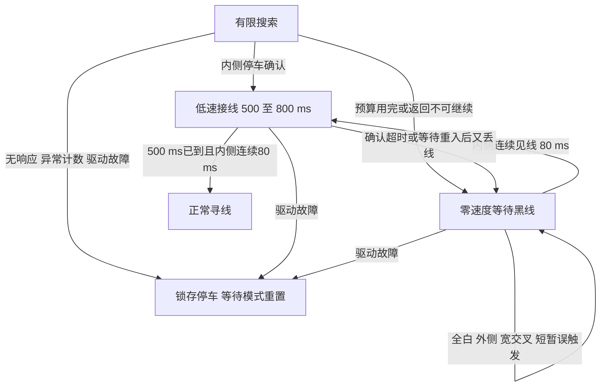

# 搜索预算停止与故障锁存分开

## 用户现象和旧代码反例

用户最新说明：丢线或重新找回后，有时完全没有报警，只是停住。
已核对集成项目记录部署 `1bf6fe6`，对应本分支 `ad0a3ee`。
没有现场时序/停止原因日志，不能断言所有无声停车都是同一根因。

但旧代码有明确、可复现的缺陷：所有恢复失败都进入 `LINE_RECOVERY_STOPPED`，
该分支在处理新黑线证据之前就返回零速度。测试耗尽三次搜索，再连续给出
内侧黑线，断言恢复前进失败，退出码 1。另一个问题是已确认捕线的低速阶段
仍套用原搜索 8 秒期限，在第 7.7 秒找回也可能来不及完成 500 ms 确认。

## 现在的行为

- 搜索 8 秒/三次扫描预算保持不变。等待时不移动、不再自动扫描，不重置
  编码器、次数或搜索起始时间。
- 只有内侧 X1 或 X3 见线，且不是两个外侧同时黑的宽交叉，连续 80 ms，
  才允许从预算停止中低速重入；先输出零速度完成确认，然后进入原低速跟随。
- 捕线的 500 ms 最短确认与 800 ms 最长确认从进入该阶段起计时，独立于
  原盲搜时钟。确认成功后才清理旧恢复历史并回到普通寻线。
- 捕线中再次丢线：正常搜索得到的捕线仅能使用尚未耗尽的原搜索预算；
  从停车等待重入的捕线若丢失，直接回到等待，不开启新一轮盲搜。
- 捕线一直不稳定，最多低速运行 800 ms 就回到等待，不无限向前试探。
- DRIVE_FAULT、NO_MOTION、ENCODER_RANGE 保持锁存；即使之后内侧一直见线，
  也不会自动解锁。实际驱动故障掩码不清除。
- 这些行为仅属于已启动的寻线模式；零 base_speed / 模式重置仍立即取消恢复。
  用户主动 STOP 不通过“等待黑线”重新启动。

## 可查询的停止原因

`LineRecovery_GetStopReason()` 返回最近的恢复停止分类；成功接线提交或模式
重置才清理。`LineRecovery_Stop(reason)` 停止恢复但不清除任何 DriveBase 故障。

| 枚举后缀 | 数值 | 处理 |
|---|---:|---|
| NONE | 0 | 无记录 |
| SEARCH_TIMEOUT | 1 | 停车等待内侧稳定见线 |
| SCAN_LIMIT | 2 | 同上 |
| RETURN_REJECTED | 3 | 同上 |
| RETURN_TIMEOUT | 4 | 同上 |
| CAPTURE_TIMEOUT | 5 | 同上 |
| REJOIN_LOST | 6 | 同上，不重开盲搜 |
| NO_MOTION | 7 | 锁存，模式重置 |
| ENCODER_RANGE | 8 | 锁存，模式重置 |
| DRIVE_FAULT | 9 | 锁存，原有驱动保护仍生效 |

这些是寻线内部枚举，不是蜂鸣声数，也不是 DRV F 的位掩码。当前没有修改
main/OLED/UART 显示路径，因此不会新增现场报警或日志；该接口供测试及集成
任务后续接入诊断使用。不要把“无报警”直接等同于可以自动解除所有停止。

## 验证和边界

- 两档 2493/1870 CPS 恢复回归、真实 DriveBase 联动及原驱动保护测试通过。
- 覆盖预算结束后持续全白不重搜、外侧/宽线/短暂内侧信号不启动、内侧稳定
  后低速重入、7.7 秒捕线跨过旧期限、超时后首次碰线、重入再次丢线不更新
  搜索预算、800 ms 捕线超时、无响应/异常计数/驱动故障仍锁存、计时回绕。
- 真实 DriveBase 测试验证“全白扫描停止→内侧停车确认→低速接线→正常”。
- 参数仍需地面验证。假黑线若持续满足内侧确认条件，也可能触发重入；
  本轮不声称解决了传感器灵敏度、地面反射或所有无声停车。
- 未验证 CPU 占用、循环最坏延迟或硬件性能；本轮修复的是已复现的状态逻辑。

本轮只修改寻线模块/接口、测试和说明，不改 PROJECT_STATE.md，不改电机输出
参数、GPIO、串口或主程序。不使用 COM11、不烧录、不移动小车。
由“黑线避障”集成本轮增量并重新构建，不直接烧录本工作树的旧基线固件。
